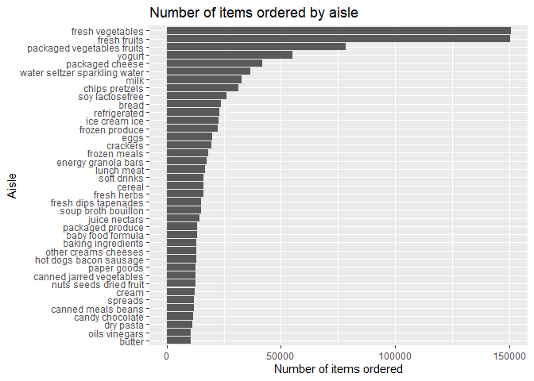
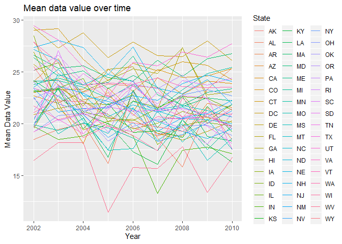
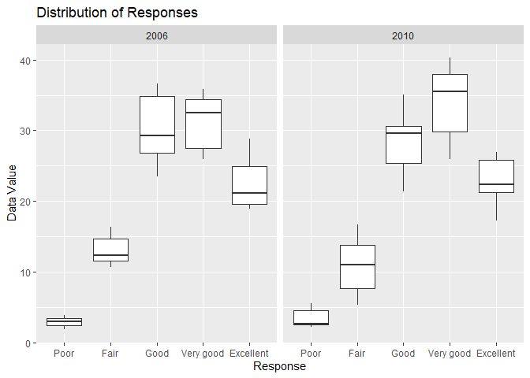
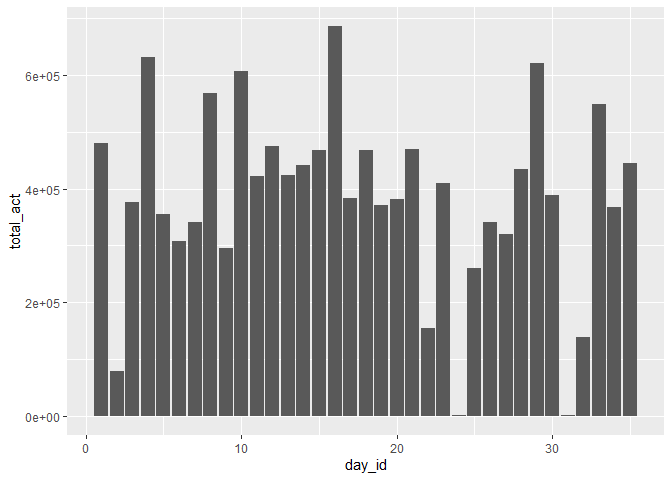
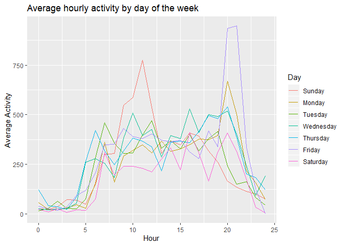

p8105\_hw3\_mfc2162
================
Madeline Cannon
10/9/2019

## Problem 1

#### Load libraries and data

``` r
library(tidyverse)
```

    ## -- Attaching packages ------------------------------------------- tidyverse 1.2.1 --

    ## v ggplot2 3.2.0     v purrr   0.3.2
    ## v tibble  2.1.3     v dplyr   0.8.3
    ## v tidyr   1.0.0     v stringr 1.4.0
    ## v readr   1.3.1     v forcats 0.4.0

    ## -- Conflicts ---------------------------------------------- tidyverse_conflicts() --
    ## x dplyr::filter() masks stats::filter()
    ## x dplyr::lag()    masks stats::lag()

``` r
library(p8105.datasets)
data("instacart")
```

There are 1384617 observations and 15 variables in this dataset. Each
observation is a product that was ordered. Some key variables are the
hour of the day at which the product was ordered, the number of days
since the last order, the name of the product, and the aisle and
department that it is in. An example of an observation is Bulgarian
yogurt, which was part of order 1, ordered at 10:00, and from the dairy
and eggs department.

#### Aisle description

``` r
aisles = instacart %>% count(aisle)
max_aisle = aisles %>% filter(n == max(pull(aisles, n)))
```

There are 134 different aisles. The fresh vegetables aisle had the most
items ordered from it.

#### Aisle plot

``` r
aisles_over_10000 = aisles %>% filter(n > 10000)

aisle_plot <- ggplot(data=aisles_over_10000, aes(x=reorder(aisle, n), y=n)) +
  geom_bar(stat="identity") + xlab("Aisle") + ylab("Number of items ordered") +
  coord_flip(xlim = NULL, ylim = NULL, expand = TRUE, clip = "on") +
  ggtitle("Number of items ordered by aisle")

aisle_plot
```

<!-- -->

#### Baking ingredients, dog food/care, and packaged vegetables/fruits table

``` r
three_aisles = instacart %>%
                filter(aisle == "baking ingredients" |
                         aisle == "dog food care" |
                         aisle == "packaged vegetables fruits") %>%
                group_by(aisle, product_name) %>%
                summarize(n_obs = n()) %>%
                filter(min_rank(desc(n_obs)) < 4)

three_aisles
```

    ## # A tibble: 9 x 3
    ## # Groups:   aisle [3]
    ##   aisle                     product_name                              n_obs
    ##   <chr>                     <chr>                                     <int>
    ## 1 baking ingredients        Cane Sugar                                  336
    ## 2 baking ingredients        Light Brown Sugar                           499
    ## 3 baking ingredients        Pure Baking Soda                            387
    ## 4 dog food care             Organix Chicken & Brown Rice Recipe          28
    ## 5 dog food care             Small Dog Biscuits                           26
    ## 6 dog food care             Snack Sticks Chicken & Rice Recipe Dog T~    30
    ## 7 packaged vegetables frui~ Organic Baby Spinach                       9784
    ## 8 packaged vegetables frui~ Organic Blueberries                        4966
    ## 9 packaged vegetables frui~ Organic Raspberries                        5546

#### Mean hour table

``` r
mean_hour_table = instacart %>%
                    filter(product_name == "Pink Lady Apples" |
                             product_name == "Coffee Ice Cream") %>%
                    group_by(product_name, order_dow) %>%
                    summarize(mean_hour = mean(order_hour_of_day)) %>%
                    pivot_wider(names_from = "product_name",
                                values_from = "mean_hour") %>%
                    mutate(order_dow = c("Sunday", "Monday", "Tuesday",
                                         "Wednesday", "Thursday", "Friday",
                                         "Saturday"))

names(mean_hour_table) = c("Day of the Week", "Pink Lady Apples", "Coffee Ice Cream")

mean_hour_table
```

    ## # A tibble: 7 x 3
    ##   `Day of the Week` `Pink Lady Apples` `Coffee Ice Cream`
    ##   <chr>                          <dbl>              <dbl>
    ## 1 Sunday                          13.8               13.4
    ## 2 Monday                          14.3               11.4
    ## 3 Tuesday                         15.4               11.7
    ## 4 Wednesday                       15.3               14.2
    ## 5 Thursday                        15.2               11.6
    ## 6 Friday                          12.3               12.8
    ## 7 Saturday                        13.8               11.9

## Problem 2

#### Load data

``` r
data("brfss_smart2010")
```

#### Clean data

``` r
brfss = brfss_smart2010 %>%
        janitor::clean_names() %>%
        mutate(state = locationabbr) %>%
        mutate(location = locationdesc) %>%
        filter(topic == "Overall Health") %>%
        mutate(response = factor(response, levels = str_c(c("Poor",
                                                            "Fair",
                                                            "Good",
                                                            "Very good",
                                                            "Excellent"))))

brfss
```

    ## # A tibble: 10,625 x 25
    ##     year locationabbr locationdesc class topic question response
    ##    <int> <chr>        <chr>        <chr> <chr> <chr>    <fct>   
    ##  1  2010 AL           AL - Jeffer~ Heal~ Over~ How is ~ Excelle~
    ##  2  2010 AL           AL - Jeffer~ Heal~ Over~ How is ~ Very go~
    ##  3  2010 AL           AL - Jeffer~ Heal~ Over~ How is ~ Good    
    ##  4  2010 AL           AL - Jeffer~ Heal~ Over~ How is ~ Fair    
    ##  5  2010 AL           AL - Jeffer~ Heal~ Over~ How is ~ Poor    
    ##  6  2010 AL           AL - Mobile~ Heal~ Over~ How is ~ Excelle~
    ##  7  2010 AL           AL - Mobile~ Heal~ Over~ How is ~ Very go~
    ##  8  2010 AL           AL - Mobile~ Heal~ Over~ How is ~ Good    
    ##  9  2010 AL           AL - Mobile~ Heal~ Over~ How is ~ Fair    
    ## 10  2010 AL           AL - Mobile~ Heal~ Over~ How is ~ Poor    
    ## # ... with 10,615 more rows, and 18 more variables: sample_size <int>,
    ## #   data_value <dbl>, confidence_limit_low <dbl>,
    ## #   confidence_limit_high <dbl>, display_order <int>,
    ## #   data_value_unit <chr>, data_value_type <chr>,
    ## #   data_value_footnote_symbol <chr>, data_value_footnote <chr>,
    ## #   data_source <chr>, class_id <chr>, topic_id <chr>, location_id <chr>,
    ## #   question_id <chr>, respid <chr>, geo_location <chr>, state <chr>,
    ## #   location <chr>

#### States observed at 7 or more locations in 2002

``` r
brfss_2002 = brfss %>%
              filter(year == 2002) %>%
              select(state, location) %>%
              distinct() %>%
              group_by(state) %>%
              summarize(n_obs = n()) %>%
              filter(n_obs > 6)

brfss_2002
```

    ## # A tibble: 6 x 2
    ##   state n_obs
    ##   <chr> <int>
    ## 1 CT        7
    ## 2 FL        7
    ## 3 MA        8
    ## 4 NC        7
    ## 5 NJ        8
    ## 6 PA       10

#### States observed at 7 or more locations in 2010

``` r
brfss_2010 = brfss %>%
              filter(year == 2010) %>%
              select(state, location) %>%
              distinct() %>%
              group_by(state) %>%
              summarize(n_obs = n()) %>%
              filter(n_obs > 6)

brfss_2010
```

    ## # A tibble: 14 x 2
    ##    state n_obs
    ##    <chr> <int>
    ##  1 CA       12
    ##  2 CO        7
    ##  3 FL       41
    ##  4 MA        9
    ##  5 MD       12
    ##  6 NC       12
    ##  7 NE       10
    ##  8 NJ       19
    ##  9 NY        9
    ## 10 OH        8
    ## 11 PA        7
    ## 12 SC        7
    ## 13 TX       16
    ## 14 WA       10

#### Excellent responses

``` r
excellent = brfss %>%
            filter(response == "Excellent") %>%
            select(year, state, data_value) %>%
            group_by(year, state) %>%
            summarize(mean_data_value = mean(data_value))

excellent
```

    ## # A tibble: 443 x 3
    ## # Groups:   year [9]
    ##     year state mean_data_value
    ##    <int> <chr>           <dbl>
    ##  1  2002 AK               27.9
    ##  2  2002 AL               18.5
    ##  3  2002 AR               24.1
    ##  4  2002 AZ               24.1
    ##  5  2002 CA               22.7
    ##  6  2002 CO               23.1
    ##  7  2002 CT               29.1
    ##  8  2002 DC               29.3
    ##  9  2002 DE               20.9
    ## 10  2002 FL               25.7
    ## # ... with 433 more rows

#### Spaghetti plot

``` r
spaghetti_plot = excellent %>%
                  ggplot(aes(x = year, y = mean_data_value, color = state)) +
                    geom_line() + xlab("Year") + ylab("Mean Data Value") +
                    labs(color = "State") +
                    ggtitle("Mean data value over time")

spaghetti_plot
```

    ## Warning: Removed 3 rows containing missing values (geom_path).

<!-- -->

#### Plot: NY responses, 2006 and 2010

``` r
ny_plot = brfss %>%
            filter(year == 2006 | year == 2010) %>%
            filter(state == "NY") %>%
            ggplot(aes(x=response, y=data_value)) + geom_boxplot() +
              facet_grid(~year) + xlab("Response") + ylab("Data Value") +
              ggtitle("Distribution of Responses")


ny_plot
```

<!-- -->

## Problem 3

#### Read and clean data

``` r
accel = read_csv("./data/accel_data.csv") %>%
          janitor::clean_names() %>%
          pivot_longer(
            activity_1:activity_1440,
            names_to = "minute",
            names_prefix = "activity_",
            values_to = "activity"
          ) %>%
          mutate(activity = as.numeric(activity)) %>%
          mutate(minute = as.numeric(minute)) %>%
          mutate(wkdy_wknd = "weekday") %>%
          mutate(day = as.factor(day)) %>%
          mutate(day = factor(day, levels = c("Sunday", "Monday", "Tuesday",
                                              "Wednesday", "Thursday",
                                              "Friday", "Saturday"))) %>%
          select(week, day_id, day, wkdy_wknd, minute, activity)
```

    ## Parsed with column specification:
    ## cols(
    ##   .default = col_double(),
    ##   day = col_character()
    ## )

    ## See spec(...) for full column specifications.

``` r
for (row in 1:nrow(accel)) {
  if (accel[row, "day"] == "Saturday" | accel[row, "day"] == "Sunday") {
    accel[row, "wkdy_wknd"] = "weekend"
  }
}

accel
```

    ## # A tibble: 50,400 x 6
    ##     week day_id day    wkdy_wknd minute activity
    ##    <dbl>  <dbl> <fct>  <chr>      <dbl>    <dbl>
    ##  1     1      1 Friday weekday        1     88.4
    ##  2     1      1 Friday weekday        2     82.2
    ##  3     1      1 Friday weekday        3     64.4
    ##  4     1      1 Friday weekday        4     70.0
    ##  5     1      1 Friday weekday        5     75.0
    ##  6     1      1 Friday weekday        6     66.3
    ##  7     1      1 Friday weekday        7     53.8
    ##  8     1      1 Friday weekday        8     47.8
    ##  9     1      1 Friday weekday        9     55.5
    ## 10     1      1 Friday weekday       10     43.0
    ## # ... with 50,390 more rows

The dataset has 50400 observations and 6 variables. The variables are
week, day\_id, day, wkdy\_wknd (which says if it is a weekday or
weekend), minute, and activity. Each observation corresponds to the
activity count for that particular minute of that particular day.

#### Aggregated activity table

``` r
agg_act = accel %>%
            group_by(day_id) %>%
            summarize(total_act = sum(activity))

agg_act
```

    ## # A tibble: 35 x 2
    ##    day_id total_act
    ##     <dbl>     <dbl>
    ##  1      1   480543.
    ##  2      2    78828.
    ##  3      3   376254 
    ##  4      4   631105 
    ##  5      5   355924.
    ##  6      6   307094.
    ##  7      7   340115.
    ##  8      8   568839 
    ##  9      9   295431 
    ## 10     10   607175 
    ## # ... with 25 more rows

``` r
agg_act_plot = ggplot(agg_act, aes(x=day_id, y=total_act)) +
  geom_bar(stat="identity")

agg_act_plot
```

<!-- -->

I can’t see any obvious trends in the data. It looks like activity
decreases slightly towards the end of the observation period.

#### Daily activity plot

``` r
daily_act = accel %>%
              mutate(hour = floor(minute / 60)) %>%
              group_by(hour, day) %>%
              summarize(mean_act = mean(activity))

daily_plot = ggplot(daily_act, aes(x=hour, y=mean_act, color=day)) +
              geom_line() + xlab("Hour") + ylab("Average Activity") +
              labs(color = "Day") +
              ggtitle("Average hourly activity by day of the week")

daily_plot
```

<!-- -->

Most activity occurs between 7am and 9pm for any day of the week. There
is very little activity between 12am and 5am. On Sundays there is a lot
of activity between 10am and 12pm, and on Fridays there is a lot of
activity between 8pm and 9pm.
